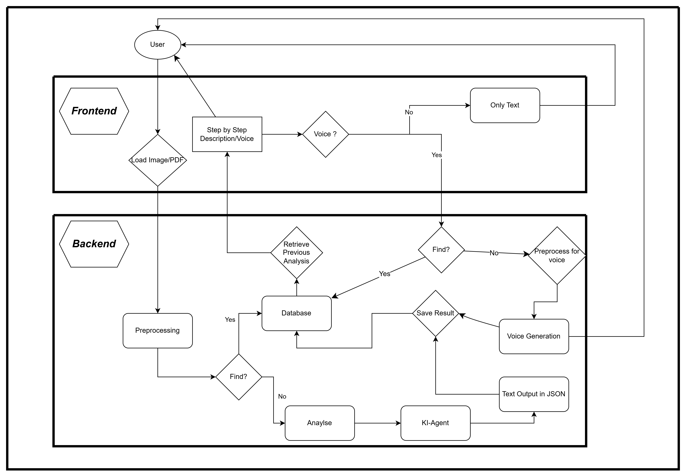

# 🛠️ IKEA Assembly Guide Assistant

A smart assistant that helps users interpret IKEA assembly manuals — making complex instructions easier to understand and act upon.  
Designed as a **full-stack application** with AI-driven components to analyze assembly instructions from PDFs and images.

---

## 🚀 Features

- 🧠 **Instruction Interpretation** – Parse IKEA manuals (PDFs / images) into structured assembly steps  
- 💬 **Interactive Assistant** – AI-based reasoning over assembly steps  
- 📄 Support for multi-page manuals with step-by-step breakdown  
- 🔧 Modular **backend / frontend** architecture  
- 🤖 Designed for **vision-language model integration** (image + text reasoning)

---

## 📁 Repository Structure

```
.
├── backend/              # Backend (AI logic, APIs, processing)
├── frontend/             # Frontend (UI for interaction)
├── documentation/        # Project documentation & notes
├── images/               # Example images & assets
├── pdfs/                 # Sample IKEA manuals
├── graphs/               # Architecture & system diagrams
├── .gitignore
├── LICENSE
└── README.md
```

---

## 🧩 Project Overview


The **IKEA Assembly Guide Assistant** aims to reduce the cognitive load of understanding IKEA manuals by:

1. Loading assembly manuals (PDFs or extracted images)
2. Detecting and isolating individual assembly steps
3. Structuring instructions in a machine-readable format
4. Enabling AI agents to reason over steps **locally and globally**
5. Providing users with clear, interactive explanations

The system is designed with **extensibility** in mind — supporting agent-based reasoning, global step analysis, and future VR / AR integration.

---

## 🛠️ Getting Started

### 🔹 Requirements

- Python 3.10+
- Node.js (18+ recommended)
- npm or yarn
- Git

---

## 🐍 Backend Setup

```bash
git clone https://github.com/KenanKhauto/IKEA_assembly_guide_assistent.git
cd IKEA_assembly_guide_assistent/backend
```

Create and activate a virtual environment:

```bash
python -m venv venv
source venv/bin/activate        # Linux / macOS
venv\Scripts\activate         # Windows
```

Install dependencies:

```bash
pip install -r requirements.txt
```

Run the backend server:

```bash
python app.py
```

---

## 🖥️ Frontend Setup

```bash
cd ../frontend
npm install
npm start
```

or with yarn:

```bash
yarn install
yarn start
```

---

## 📌 Usage

1. Start backend and frontend services  
2. Open the frontend in your browser  
3. Upload an IKEA manual (PDF or images)  
4. Interact with the assistant to:
   - Understand individual steps
   - Ask clarification questions
   - Navigate complex assemblies

---

## 🧠 AI & System Design

- Multi-step instruction reasoning
- Support for **agent-based communication**
- Designed for **vision-language models**
- Separation between parsing, reasoning, and global understanding

Architecture diagrams can be found in the `graphs/` directory.

---

## 🧪 Testing

```bash
pytest
```

Frontend tests:

```bash
npm test
```

---

## 💡 Future Work

- 🔍 Advanced diagram understanding using VLMs
- 🤖 Multi-agent debate between instruction interpreters
- 🧩 Global dependency reasoning across steps
- 🕶️ AR / VR assembly assistance
- 📄 Exportable summarized instructions

---

## 🛡️ License

See the `LICENSE` file for details.

---

## 📬 Contact

**Author:** Kenan Khauto  
GitHub: https://github.com/KenanKhauto
