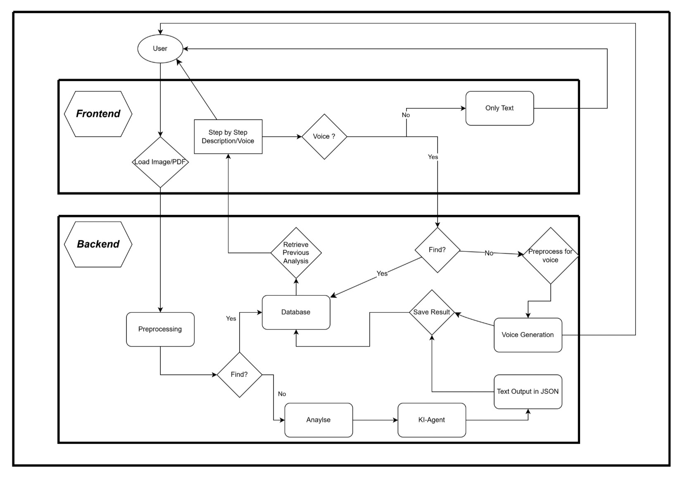
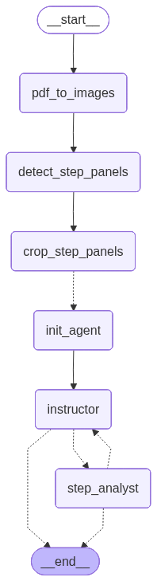

# IKEA Assembly Guide Assistant

A full-stack AI system that transforms visual IKEA assembly manuals into structured, human-readable instructions.

The project combines **computer vision**, **agentic AI workflows**, and **vision-language reasoning** to convert complex IKEA diagrams into accessible, sequential assembly guidance.

Designed as a research-driven software engineering project at Goethe University Frankfurt, the system focuses on reducing hallucinations and improving reliability compared to naïve multimodal LLM approaches.

---

## Table of Contents

* [Overview](#overview)
* [Motivation](#motivation)
* [Key Features](#key-features)
* [System Architecture](#system-architecture)
* [Pipeline Overview](#pipeline-overview)
* [Technology Stack](#technology-stack)
* [Repository Structure](#repository-structure)
* [Requirements](#requirements)
* [Installation](#installation)

  * [Backend Setup](#backend-setup)
  * [Frontend Setup](#frontend-setup)
* [Usage](#usage)
* [How the System Works](#how-the-system-works)

  * [1. Input Processing](#1-input-processing)
  * [2. YOLO-Based Step Detection](#2-yolo-based-step-detection)
  * [3. Agentic Reasoning Pipeline](#3-agentic-reasoning-pipeline)
  * [4. Instruction Generation](#4-instruction-generation)
* [AI Design Decisions](#ai-design-decisions)
* [Evaluation](#evaluation)
* [Output Format](#output-format)
* [GUI](#gui)
* [Limitations](#limitations)
* [Future Work](#future-work)
* [Research & Engineering Goals](#research--engineering-goals)
* [License](#license)
* [Authors](#authors)

---

# Overview

The **IKEA Assembly Guide Assistant** is an AI-powered semantic translation system for technical diagrams.

Instead of treating IKEA manuals as simple image-captioning tasks, the system decomposes manuals into isolated assembly steps and processes them through a structured multi-agent reasoning workflow.

The architecture combines:

* **YOLO object detection** for step segmentation
* **LangGraph agent orchestration**
* **Vision-language models (VLMs)** for reasoning
* **Hybrid neuro-symbolic workflows** for reliable instruction generation

The goal is to bridge the gap between:

* **Visual instructions** → implicit knowledge
* **Text instructions** → explicit, accessible knowledge

---

# Motivation

Traditional IKEA manuals:

* rely entirely on visual communication
* are inaccessible for many visually impaired users
* increase cognitive load for complex furniture builds
* are difficult to search or index digitally
* often confuse general-purpose multimodal LLMs

Directly sending full manual pages into standard LLMs frequently causes:

* attention drift
* step confusion
* hallucinated instructions
* incorrect part assignments
* missing safety details

This project addresses those problems using a structured AI pipeline that isolates and validates assembly steps individually.

---

# Key Features

* Convert IKEA manuals into structured text instructions
* Support for PDF and image-based manuals
* Sequential step-by-step instruction generation
* YOLO-based assembly step detection
* Multi-agent reasoning using LangGraph
* Reduced hallucination rate compared to direct GPT prompting
* Modular backend/frontend architecture
* Interactive graphical interface
* Context-aware instruction generation
* Designed for accessibility and text-to-speech integration
* JSON-based structured outputs
* Support for complex multi-page manuals

---

# System Architecture



The application follows a **split-stack hybrid architecture**:

| Layer                  | Responsibility                           |
| ---------------------- | ---------------------------------------- |
| Frontend               | User interaction, uploads, navigation    |
| Backend                | Processing pipeline, orchestration, APIs |
| YOLO Detection         | Detects assembly step panels             |
| LangGraph Agents       | Controls reasoning workflow              |
| Vision-Language Models | Interprets visual assembly steps         |
| Database / Storage     | Stores generated outputs and metadata    |

The architecture deliberately separates:

* **Perception** → locating visual steps
* **Reasoning** → understanding assembly logic

This reduces hallucinations and improves instruction precision.

---

# Pipeline Overview

The system operates in two major phases.

## Phase 1 — Local Preprocessing

1. PDF manual is converted into images
2. YOLO detects individual assembly panels
3. Each step is cropped into a standalone image
4. Visual noise from surrounding steps is removed

## Phase 2 — Agentic Reasoning

1. Cropped steps are processed sequentially
2. LangGraph manages orchestration
3. Specialized agents analyze visual relationships
4. Structured instructions are generated
5. Results are compiled into final step-by-step output

---

# Technology Stack

## Backend

* Python 3.10+
* FastAPI / Flask-style backend architecture
* LangGraph
* OpenAI GPT-4o APIs
* YOLOv8 Nano
* CUDA acceleration
* PDF/image preprocessing utilities

## Frontend

* Node.js 18+
* React-based frontend architecture
* Interactive instruction viewer
* File upload interface

## AI / ML

* Vision-Language Models (VLMs)
* Multi-agent orchestration
* Object detection
* Structured JSON prompting

---

# Repository Structure

```text
.
├── backend/              # AI logic, APIs, orchestration, processing
├── frontend/             # User interface and frontend application
├── documentation/        # Research report and project documentation
├── images/               # Example images and README assets
├── pdfs/                 # Sample IKEA manuals
├── graphs/               # Architecture and system diagrams
├── .gitignore
├── LICENSE
└── README.md
```

---

# Requirements

## System Requirements

| Requirement | Version                             |
| ----------- | ----------------------------------- |
| Python      | 3.10+                               |
| Node.js     | 18+                                 |
| GPU         | CUDA-enabled NVIDIA GPU recommended |
| Internet    | Required for VLM API communication  |

## Recommended Hardware

* NVIDIA GPU with CUDA support
* 16GB+ RAM
* Modern multi-core CPU

---

# Installation

## Backend Setup

Clone the repository:

```bash
git clone https://github.com/KenanKhauto/IKEA_assembly_guide_assistent.git
cd IKEA_assembly_guide_assistent/backend
```

Create and activate a virtual environment:

```bash
python -m venv venv
```

### Linux / macOS

```bash
source venv/bin/activate
```

### Windows

```bash
venv\Scripts\activate
```

Install backend dependencies:

```bash
pip install -r requirements.txt
```

Run the backend server:

```bash
python app.py
```

---

## Frontend Setup

Navigate to the frontend:

```bash
cd ../frontend
```

Install dependencies:

```bash
npm install
```

Start the frontend:

```bash
npm start
```

### Alternative using Yarn

```bash
yarn install
yarn start
```

---

# Usage

1. Start backend and frontend services
2. Open the frontend in your browser
3. Upload an IKEA manual (PDF or images)
4. Wait for preprocessing and analysis
5. Navigate through generated assembly instructions
6. Interact with the assistant for clarification

---

# How the System Works

## 1. Input Processing

The system accepts:

* IKEA PDF manuals
* Extracted manual images
* Multi-page instruction documents

The preprocessing layer converts manuals into high-resolution rasterized images.

The system also identifies:

* title pages
* safety warnings
* inventory pages
* information modules
* warning modules
* assembly steps

---

## 2. YOLO-Based Step Detection

The project uses a trained **YOLOv8 Nano** detection model to identify assembly step panels.

### Training Configuration

| Parameter        | Value       |
| ---------------- | ----------- |
| Model            | YOLOv8 Nano |
| Epochs           | 100         |
| Batch Size       | 16          |
| Optimizer        | SGD         |
| Image Size       | 640x640     |
| Validation Split | 80/20       |

### Dataset

* 125 manually annotated IKEA manual images
* Multiple furniture categories
* Bounding boxes for assembly steps

### Detection Goals

* isolate reasoning units
* reduce visual ambiguity
* prevent cross-step hallucinations
* improve instruction ordering

---

## 3. Agentic Reasoning Pipeline



The reasoning architecture is implemented using **LangGraph**.

Instead of relying on a single monolithic prompt, the system uses a multi-agent workflow.

## Instructor Agent

Responsibilities:

* maintains global assembly state
* controls step sequencing
* validates generated outputs
* compiles final instruction sets
* verifies adherence to schema constraints

## Step Analyst Agent

Responsibilities:

* analyzes one cropped step at a time
* extracts visual relationships
* identifies parts and fasteners
* generates structured JSON output
* reduces hallucinations through localized reasoning

This division dramatically improves reliability compared to directly prompting a multimodal LLM with full pages.

---

## 4. Instruction Generation

The final output is transformed into structured text instructions.

Each generated instruction typically contains:

* step number
* action summary
* required parts
* quantities
* assembly actions
* warnings and constraints
* tool restrictions

### Example Structure

```text
Step 4 — Attach Side Panel

Required Parts:
- Panel B
- 4x screws
- Wooden dowels

Instructions:
1. Align Panel B with the side holes.
2. Insert the dowels into the marked slots.
3. Tighten the screws clockwise.
4. Ensure the panel sits flush before continuing.
```

---

# AI Design Decisions

## Why Not a Naïve LLM Approach?

Directly analyzing full manual pages with GPT-4o introduces:

* attention drift
* skipped details
* incorrect part references
* ordering failures
* hallucinated steps

The proposed pipeline solves this by:

* isolating steps visually
* reasoning sequentially
* enforcing structured outputs
* separating detection from cognition

## Why Not RAG?

Retrieval-Augmented Generation (RAG) was rejected because:

* IKEA instructions are primarily visual
* no large structured textual knowledge base exists
* the required knowledge is embedded in diagrams

## Why Not Fine-Tuning?

Fine-tuning VLMs was considered impractical due to:

* lack of large annotated datasets
* GPU and training costs
* long iteration cycles
* project time constraints

The chosen agentic approach provided faster experimentation and better development agility.

---

# Evaluation

The system was evaluated qualitatively and quantitatively.

## Evaluation Dimensions

| Dimension    | Description                                    |
| ------------ | ---------------------------------------------- |
| Correctness  | Are instructions visually accurate?            |
| Completeness | Are all major actions included?                |
| Ordering     | Are steps extracted sequentially?              |
| Clarity      | Are instructions understandable independently? |
| Faithfulness | Does output avoid hallucinations?              |
| Granularity  | Are steps atomic and consistent?               |

## Key Findings

### Strengths

* Correct ordering across evaluated manuals
* Strong extraction of major assembly actions
* Improved faithfulness compared to direct GPT prompting
* Better handling of warnings and constraints
* Reduced hallucination rates through crop isolation

### Remaining Challenges

* visually similar screws may be confused
* small tools may be omitted
* occasional over-specification by the LLM
* vague spatial language in some instructions
* title pages may occasionally be misclassified

---

# Output Format

The pipeline produces structured outputs in JSON-like sequential instruction form.

Generated outputs can also support:

* text-to-speech systems
* accessibility tools
* voice assistants
* searchable instruction databases
* interactive assembly interfaces

---

# GUI

The project includes an interactive frontend interface for:

* uploading manuals
* navigating assembly steps
* viewing generated instructions
* interacting with the assistant
* sequential instruction browsing

The interface follows a minimalist PDF-converter-inspired design philosophy.

---

# Limitations

Current limitations include:

* dependence on standardized IKEA visual syntax
* occasional ambiguity in arrow interpretation
* confusion between visually similar hardware
* inability to fully guarantee zero hallucinations
* dependence on external VLM APIs
* GPU requirement for efficient local detection

The project is currently a proof-of-concept research system rather than a production-ready industrial platform.

---

# Future Work

Planned improvements include:

* exportable summarized instructions
* integrated text-to-speech playback
* multilingual output generation
* improved part recognition
* better warning interpretation
* stronger verification loops
* local VLM deployment support
* real-time assembly assistance
* mobile application support
* confidence scoring for ambiguous steps

---

# Research & Engineering Goals

The project was developed as part of a software engineering initiative at Goethe University Frankfurt.

Core engineering goals included:

* building a complete full-stack AI system
* exploring agentic AI workflows
* integrating ML models into production-style pipelines
* reducing hallucinations in technical reasoning tasks
* improving accessibility of visual instruction systems
* demonstrating advantages of orchestrated AI architectures

---

# License

See the `LICENSE` file for details.

---

# Authors

* Kenan Khauto
* Christian Block
* Daulet Ashirov
* Finn Karstens

## GitHub

* [https://github.com/KenanKhauto](https://github.com/KenanKhauto)
* [https://github.com/topoftheblock](https://github.com/topoftheblock)
